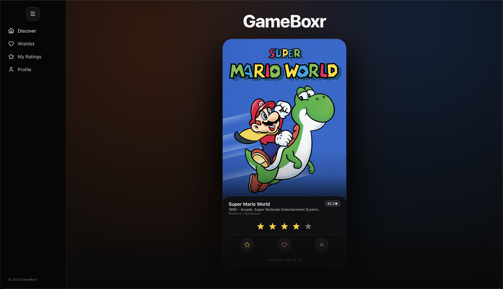

# 🎮 GameBoxr

GameBoxr is a modern web app for discovering, rating, and tracking games across multiple platforms — designed with gamers and developers in mind.  
It focuses on clean UI, smooth scrolling, and a poster-first experience that makes managing your game library actually enjoyable.

---

## ✨ Features

- 🕹️ **Game Discovery** – Browse and filter games by platform, genre, or popularity.  
- ⭐ **Rate & Track** – Add personal ratings and statuses like *Wishlist*, *Playing*, *Paused*, or *Finished*.  
- 📱 **Responsive Design** – Mobile-first layout with buttery scrolling and performance-optimized rendering.  
- 🔍 **Smart Search** – Quickly find games by title or filter by genre/platform.  
- 💾 **Optimistic UI Updates** – Instant feedback when updating ratings or statuses.  
- 🖼️ **Poster-First Cards** – Every game card displays full-height box art, similar to movie posters.  

---

## 🧠 Tech Stack

| Category | Technologies |
|-----------|---------------|
| Frontend | React, TypeScript, Vite, TailwindCSS |
| UI Library | Shadcn/UI, HeadlessUI, Radix Primitives |
| State Management | React Hooks, Context API |
| Backend | Node.js, Express |
| Database | PostgreSQL (via Prisma ORM) |
| Other Tools | ESLint, Prettier, Netlify Deployment |

---

## 🗺️ Roadmap / Future Developments
🔮 Short-Term
- 🎨 Social share images (Open Graph previews for user profiles)
- 🧾 “Compare Your Taste” page (side-by-side game taste comparison)
- 🕵️ Game Finder (Tinder-style swipe interface for discovering new games)
- 📺 Embedded trailers and media galleries
- 💬 User reviews and comment threads

🚀 Long-Term
- 🧠 AI-assisted recommendations
- 🌐 Multiplayer/co-op filters by genre and platform
- 🔔 Push notifications for wishlist releases
- 👥 Social following and friend leaderboards
- 📊 Personal analytics dashboard for playtime, ratings, and completion stats

## 🧩 Development Journey

Building GameBoxr has been a deep, hands-on experience in modern front-end architecture.
The focus was to make the UI feel alive — scroll snapping, hover transitions, optimistic updates, and component modularity.

## 🔧 Core Design Choices

- Scroll Snap Carousels: For smooth horizontal navigation between posters.
- Optimistic UI Updates: Game ratings appear instantly while syncing in the background.
- Dynamic Lightbox: Custom-built full-screen image viewer with keyboard navigation.
- Poster-First Design: Emphasis on immersive visuals and simplicity.
- Reusable Components: Cards, Modals, and Buttons are shared and theme-aware (light/dark mode compatible).

## 🧱 Front-End Engineering Highlights

- TailwindCSS used with Shadcn/UI for composable, themeable components.
- Minimal global state — React Hooks manage per-view state.
- Performance optimized through lazy loading and responsive image sizing.
- Built using Vite for near-instant dev server feedback.

## 🧠 Lessons Learned

Throughout the project, I strengthened my understanding of:
- TypeScript integration with complex component props
- State management patterns in React
- UI performance and accessibility trade-offs
- Self-guided project planning and milestone tracking

